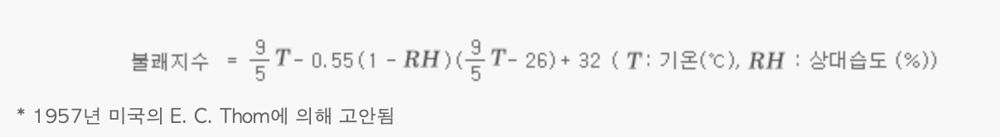
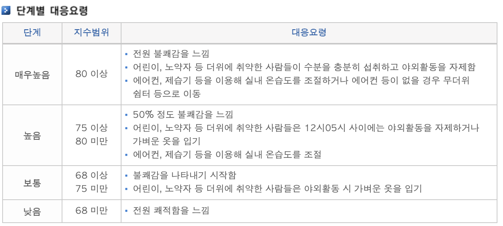
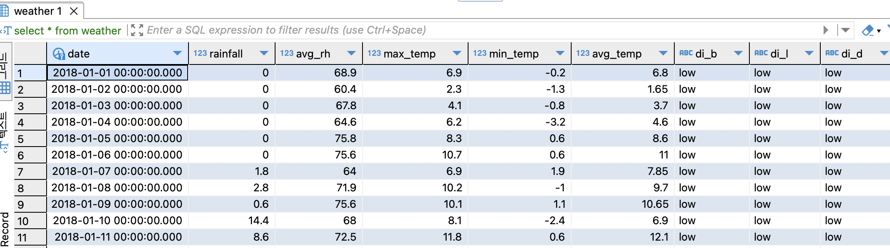

# DataCleaning

Dirty Data Cleaning...
원본 데이터를 전처리를 통해 Cleaning 후 DB에 삽입
 

## Used

-   Conda Env: Python 3.9
-   Library:
    -   openpyxl 3.1.2
    -   pandas 2.2.1
    -   SQLAlchemy 2.0.20
    -   numpy 1.24.3

## Process

1. Meal Data
    - Data Load -> 결측치 확인 -> 이벤트 컬럼 처리 -> 데이터 분리 -> 메뉴 데이터 처리
2. Weather Data
    - Data Load -> 결측치 확인 -> 불쾌지수 계산 후 컬럼 추가

## Meal Data

### 이벤트 컬럼 처리

-   "휴일, 중간고사, 기말고사, 견학, 없음" 총 5개의 종류로 분류한다.

### 데이터 분리

-   회귀를 위한 모델 학습을 위한 데이터를 만들기 위해 ,로 구분되어 있는 메뉴 문자열을 분리해야 한다.
-   조식, 중식, 석식 메뉴 개수가 각각 다르다.
-   통합으로 최소 메뉴 개수를 기준으로 분리하면 데이터 손실이 발생할 수 있다.
-   조식, 중식, 석식을 위한 데이터로 구분한다.

### 메뉴 데이터 처리

1.  메뉴 분리

    -   메뉴의 첫번째 값을 살펴보니 "잡곡밥","밥" 다른 날은 국이나 특별한 음식이 나오는데, 잡곡밥이 나오는 경우가 있음.
    -   "김치"가 마지막에 나오거나 중간에 나오는 경우가 있는데 김치는 식사 인원에 영양을 줄 것 같지 않음.
    -   이 잡곡밥, 밥, 김치는 식수 인원에 크게 영향을 줄 것 같지 않음.
        -   잡곡밥,밥, 김치가 나올 경우 다음 메뉴로 선택
    -   "쨈","~장"이 마지막에 나오는 경우가 있음.
        -   쨈, ~장이 나올경우 그 전꺼 선택
    -   한 개의 문자열로 된 메뉴를 분리할 때, 메뉴의 개수도 제각각 이기 때문에 제일 적은 메뉴 개수를 기준으로 분리해야함.
        -   ex. 메뉴가 5,6개 있으면 5개로 설정해서 6개 중 5개 선택
    -   메뉴 선택 우선순위
        1. 제일 뒤 메뉴(부식이 있으면 이 위치)
        2. 제일 앞
        3. 앞에서 두번째
        4. ...
    -   메뉴에 공백이 있는 경우가 있어 양쪽 split 전에 공백 제거해줘함.

2.  메뉴 분석
    -   메뉴 데이터를 살펴보면 같은 메뉴의 종류가 너무 많음.
    -   메뉴의 대분류를 이용하면 종류의 개수를 줄일 수 있을 것 같음.

## Weather

### 불쾌지수 계산

https://www.weather.go.kr/plus/life/li_asset//HELP/basic/help_01_05.jsp 
 
 

1. 최고기온시각, 최저기온시각을 체크하여 각각 어느 시간대에 최고기온, 최저기온, 평균기온을 사용할지 체크한다.
    - 만약 같은 시간대에 두 기온이 True로 체크될 시 최고기온 사용하여 불쾌지수 구한다.
2. 각 식사 시간대별로 불쾌지수 단계 설정한다.
3. 시각 컬럼을 삭제한다.

## DB 저장

SQLAlchemy의 engine을 이용해 DB를 연결하고 Table을 만들고 df.to_sql()을 사용해 DataFrame을 DB에 추가한다. 

